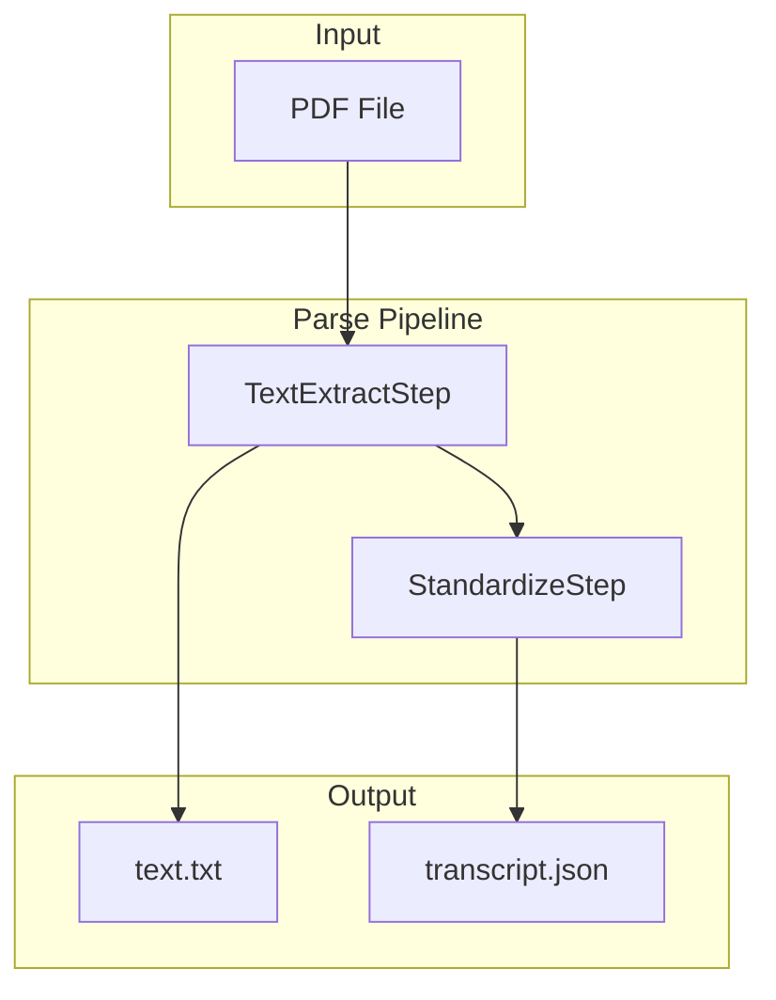
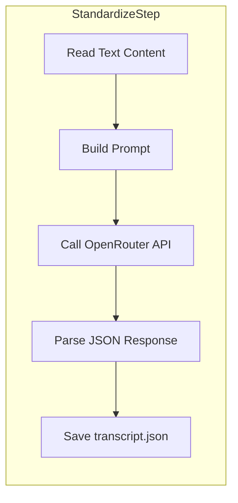

# Parse Pipeline System

This document describes the parse pipeline architecture for extracting structured transcript data from PDF files.

## Overview

The parse pipeline converts PDF transcripts into standardized JSON data through a series of processing steps.



## Pipeline Steps

### Step 1: TextExtractStep (Default)

Extracts raw text from PDF using PyPDF2. Fast, no API call required.

**Input:** PDF file  
**Output:** `text.txt` - Raw extracted text

**Implementation:** `api/pipeline/steps/text_extract.py`

### Step 1 (Alternative): ReductoStep

Calls the Reducto API for more advanced PDF parsing with layout/table support.

**Input:** PDF file  
**Output:** `reducto.json` - Raw parsed content with blocks, tables, and layout info

**Implementation:** `api/pipeline/steps/reducto.py`

### Step 2: StandardizeStep

Uses an LLM via OpenRouter to convert the extracted text into structured transcript data.

**Input:** `text.txt` content (or `reducto.json` if using ReductoStep)  
**Output:** `transcript.json` - Standardized transcript schema

**Implementation:** `api/pipeline/steps/standardize.py`



## Entry Points

### CLI (Local Testing)

Run the pipeline directly on a local PDF file:

```bash
python -m api --pdf /path/to/transcript.pdf
```

Options:
- `--job-id <id>` - Custom job ID (auto-generated if omitted)
- `--output-dir <path>` - Custom output directory
- `--dry-run` - Skip API calls (for testing)

### Worker (Production)

The parse worker polls the job queue and processes jobs asynchronously:

```bash
python -m api.parse
```

### Programmatic

```python
from api.pipeline import run_pipeline

artifacts = run_pipeline(
    job_id="my-job",
    local_pdf_path="/path/to/transcript.pdf",
)

print(artifacts.transcript)  # Extracted data
print(artifacts.outputs)     # Output file paths
```

## Output Structure

All outputs are saved to `debug/<job_id>/`:

```
debug/
└── <job_id>/
    ├── source.pdf        # Copy of input file
    ├── text.txt          # Extracted text (from TextExtractStep)
    ├── transcript.json   # Standardized transcript data
    └── standardize/
        ├── request.json  # LLM API request payload
        └── response.json # LLM API response
```

## Configuration

### Environment Variables

Set in `api/.env`:

| Variable | Description |
|----------|-------------|
| `OPENROUTER_API_KEY` | OpenRouter API key for LLM extraction (required) |
| `REDUCTO_API_KEY` | Reducto API key (optional, only if using ReductoStep) |

### Pipeline Customization

Override default steps when calling `run_pipeline()`:

```python
from api.pipeline import run_pipeline, ReductoStep, TextExtractStep, StandardizeStep

# Use Reducto instead of PyPDF2
custom_steps = [
    ReductoStep(),
    StandardizeStep(),
]

# Or use a different LLM model
custom_steps = [
    TextExtractStep(),
    StandardizeStep(model="anthropic/claude-3-haiku"),
]

artifacts = run_pipeline(
    local_pdf_path="transcript.pdf",
    steps=custom_steps,
)
```

## Architecture

### Core Types

**ParseInput** - Pipeline input configuration:
- `job_id` - Unique job identifier
- `file_id` - Supabase Storage file ID (for worker)
- `output_dir` - Where to save outputs
- `dry_run` - Skip API calls flag
- `local_pdf_path` - Local file path (for CLI)

**ParseArtifacts** - Accumulated outputs:
- `pdf_path` - Path to input PDF
- `text_content` - Extracted text (from TextExtractStep)
- `reducto_result` - Raw Reducto response (if using ReductoStep)
- `transcript` - Extracted transcript data
- `outputs` - Map of output name to file path
- `errors` - List of errors encountered

### Step Interface

All steps implement the `ParseStep` base class:

```python
class ParseStep(ABC):
    name: str
    
    @abstractmethod
    def run(self, artifacts: ParseArtifacts) -> ParseArtifacts:
        """Execute step and return updated artifacts."""
        pass
```

### File Structure

```
api/
├── __main__.py              # CLI entry point
├── parse.py                 # Worker process
├── pipeline/
│   ├── __init__.py          # run_pipeline() export
│   ├── types.py             # ParseInput, ParseArtifacts
│   ├── executor.py          # Runs steps in sequence
│   └── steps/
│       ├── base.py          # Abstract ParseStep
│       ├── text_extract.py  # TextExtractStep (default)
│       ├── reducto.py       # ReductoStep (alternative)
│       └── standardize.py   # StandardizeStep
```

## Adding New Steps

1. Create a new step file in `api/pipeline/steps/`:

```python
from api.pipeline.steps.base import ParseStep
from api.pipeline.types import ParseArtifacts

class MyNewStep(ParseStep):
    name = "my_step"
    
    def run(self, artifacts: ParseArtifacts) -> ParseArtifacts:
        # Process artifacts.transcript or other data
        # Save output to artifacts.input.output_dir
        # Update artifacts with results
        return artifacts
```

2. Export in `api/pipeline/steps/__init__.py`

3. Add to `default_steps()` in `api/pipeline/__init__.py`

## Related Documentation

- [TRANSCRIPT_SCHEMA.md](TRANSCRIPT_SCHEMA.md) - Output schema specification
